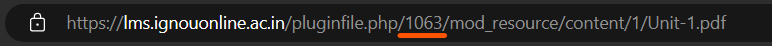

# IGNOU PDF downloader

This project is a Node.js CLI application designed to download PDF files from the Indira Gandhi National Open University's (IGNOU's) Learning Management System (LMS) website, combine them into a single PDF, and save the resulting file with a user-defined name.

## Installation

1. Clone the repository
2. Navigate to the project directory
3. Install dependencies with `pnpm install` (or `npm install`)

## Usage

This application requires a few environment variables in order to run properly. These variables are stored in a `.env` file at the root directory of the project.

The `.env` file should contain the following variables:

```bash
START_INDEX=1
NUM_PDFS=10
SESSION_COOKIE=your_session_cookie_here
PDF_NAME=output.pdf
```

-   `START_INDEX`: The starting number of the PDF you would like to download. It can be found in the PDFs URL from IGNOU's LMS. It corresponds to Unit-1 of the subject you are trying to download.

    .

-   `NUM_PDFS`: The number of PDF files to download. Make sure that it is less than or equal to the number of units in the subject. Typically, this number is 14.
-   `SESSION_COOKIE`: Your session cookie for the IGNOU website. You can get this using the devtools. The cookie is called `MoodleSession` and the `SESSION_COOKIE`'s value should be in the format `MoodleSession=xxxxxx`.
-   `PDF_NAME`: The desired name of the combined PDF file.

After setting the required variables in the `.env` file, run the application with `pnpm start`.

The application will download the number of PDF files specified in `NUM_PDFS` starting from the PDF number defined in `START_INDEX` to your local `pdf` directory. It will then combine the downloaded PDF files into a single file and save it to the root directory with the name specified in `PDF_NAME`. It will then delete the `pdfs` folder and all individual PDF files.

## Disclaimer

This project is for educational purposes only. Use at your own risk.

## License

This project is licensed under the MIT License. See the LICENSE file for more information.
